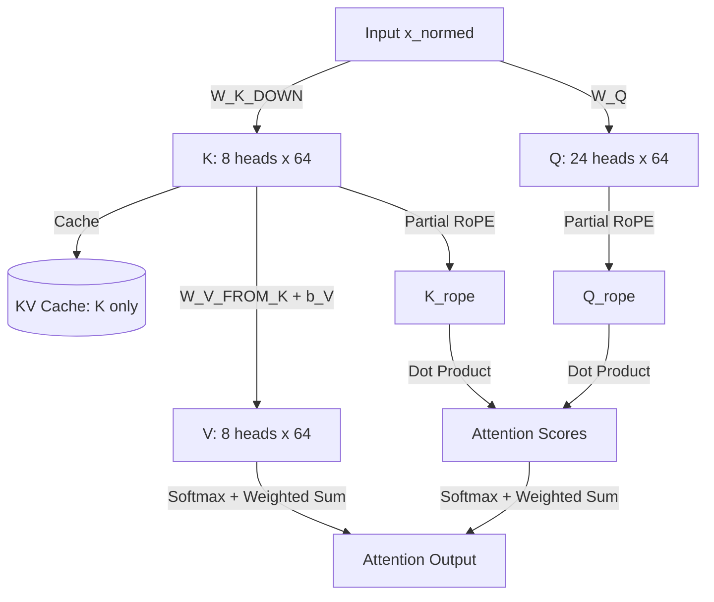
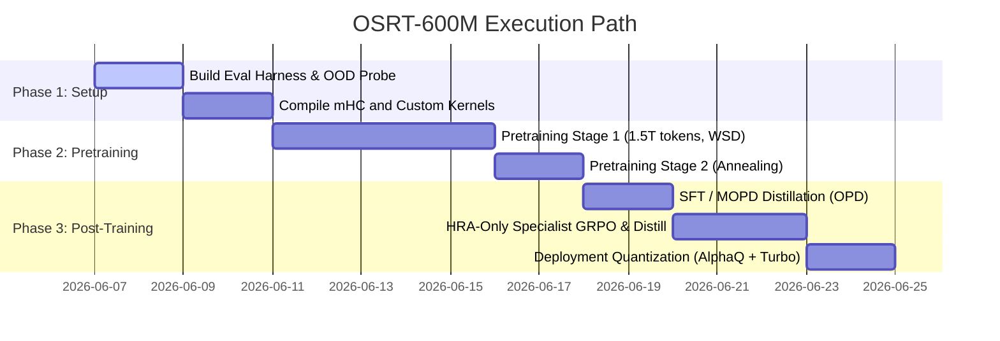

# Plan Review: OSRT-600M Architectural & Pipeline Analysis

**Review Date:** 2026-06-07  
**Author:** Antigravity AI Pair Programmer  
**Target Proposal:** OSRT-600M (described in [`README.md`](../README.md), [`ARCHITECTURE.md`](../ARCHITECTURE.md), [`LEARNINGS.md`](../LEARNINGS.md), and [`RESEARCH.md`](../RESEARCH.md))

---

## Executive Summary

The transition from the **nano-osrt-100M** (v5, 363M parameters) to the **OSRT-600M** (v6) represents a mature shift in engineering philosophy: moving from **hope-based architectural speculation** to **measurement-first engineering**. The v5 post-mortem identified clear, silent failure modes (loop collapse, router collapse, training base weights during RL, and lack of day-1 system prompt support) that have been directly addressed in the v6 design.

This review provides a critical, mathematical, and practical evaluation of the proposed OSRT-600M architecture and training pipelines. While the plan is highly sophisticated, several hidden risks, mathematical constraints, and pipeline friction points must be addressed before training begins.

---

## 1. Architectural Analysis & Structural Bottlenecks

### 1.1 The GQA / MLA Hybrid: "V-from-K" Derivation
The plan proposes a hybrid attention mechanism: using Grouped Query Attention (GQA) but caching only the key projection ($K_{DOWN} \in \mathbb{R}^{512}$) and deriving the value projection ($V$) dynamically at decode time via a learned transformation:
$$V = W_{V\_FROM\_K} K + b_V$$
where $W_{V\_FROM\_K} \in \mathbb{R}^{512 \times 512}$ and $b_V \in \mathbb{R}^{512}$.



#### Critical Risks & Discrepancies:
1. **Rank & Expressivity Limitation:** 
   In standard attention, $K$ and $V$ are independent projections of the token representation $x$, representing *what the token matches* (Key) and *what information the token contains* (Value) respectively. Restricting $V$ to be a linear transformation of $K$ forces the token's value information to lie entirely within the subspace spanned by its keys. If a token needs to act as a routing anchor (high matching affinity for many queries, requiring a specific $K$) but yield different, context-specific information (requiring an independent $V$), the model's expressivity is severely bottlenecked.
2. **RoPE Interaction and Caching Sequence:**
   Section 6.5 specifies that **Partial RoPE** is applied to the last 64 dimensions of each head of $Q$ and $K$. If $K$ is rotated before caching, the linear relationship between $K$ and $V$ is broken because RoPE is position-dependent ($R_\theta^{(m)} K$). Therefore, **the un-rotated $K$ must be cached**, and $V$ must be computed from the un-rotated $K$. RoPE must then be applied to $K$ *after* loading from the cache at decode time.
3. **MLA Equivalence:**
   This is *not* equivalent to DeepSeek's Multi-Head Latent Attention (MLA). MLA compresses both $K$ and $V$ into a shared latent vector $c_{KV}$ and uses decoupled queries and keys for RoPE. In the OSRT-600M design, there is no query-side latent compression, meaning we do not get the full FLOP-saving matrix absorption benefits of MLA during the prefill phase (since $Q$ is still projected to full head dimensions and dot-producted with reconstructed keys).

> [!TIP]
> **Recommendation:** To recover expressivity, either implement true DeepSeek-style MLA (with $c_{KV}$ latent compression and decoupled RoPE keys) or widen the rank of $W_{V\_FROM\_K}$ by mapping from a larger latent KV representation, rather than constraining $V$ to be a direct linear child of $K$.

---

### 1.2 Manifold-Constrained Hyper-Connections (mHC)
To stabilize the deep recursive stack (18 effective layers from 3 physical blocks unrolled 6 times), the design introduces mHC, forcing the residual mixing matrix $B_l$ to lie on the Stiefel manifold / Birkhoff polytope via Sinkhorn-Knopp projection:
$$X_{l+1} = B_l X_l + C_l F_l(A_l X_l)$$

#### Feasibility & Overhead:
* **Stability:** This is a brilliant and necessary inclusion. Recursive residual connections can act as compounding amplifiers of numerical instability. Bounding the spectral norm of $B_l$ ($\|B_l\|_2 \le 1$) mathematically guarantees that the residual stream cannot explode.
* **FLOP and Latency Tax:** Generating $A_l, B_l, C_l$ dynamically per token requires projecting the flattened and normalized residual stream ($1 \times 6144$) to $4$, $16$, and $4$ dimensions respectively:
  * $W_{pre} \in \mathbb{R}^{6144 \times 4} \rightarrow 24,576$ parameters.
  * $W_{res} \in \mathbb{R}^{6144 \times 16} \rightarrow 98,304$ parameters.
  * $W_{post} \in \mathbb{R}^{6144 \times 4} \rightarrow 24,576$ parameters.
  * This adds **~147K parameters per injection point**. With 3 physical blocks and 2 sub-blocks (Attn/FFN) per block, this is 6 injection points, totaling **~885K parameters** (roughly matching the ~720K estimate in the spec).
  * However, executing **20 iterations of Sinkhorn-Knopp** per token, per sub-block, per loop iteration (36 times per forward pass) in the training loop will introduce significant CPU-GPU synchronization overhead unless written as a highly optimized, fused CUDA kernel.

> [!WARNING]
> **Performance Warning:** A pure PyTorch implementation of Sinkhorn-Knopp (alternating row and column normalization in a Python loop of 20) inside the model's forward pass will bottleneck GPU utilization. You must compile this block using `torch.compile` or implement a custom Triton kernel.

---

### 1.3 Recursive MoE & Loop Embedding Mechanics
The recurrence relies on adding loop-specific biases (`loop_emb`) to break symmetry across iterations:
$$x = x + loop\_emb[\min(r, 7)]$$
The routing configuration is $1$ shared expert ($h=4,608$) + $12$ routed experts ($h=1,920$, top-2 active).

#### Critical Structural Checks:
1. **The $min(r,7)$ Boundary:**
   Capping the loop index at 7 is a hard architectural invariant. While this stabilizes inference for the trained 6 loops, it prevents "infinite" test-time unrolling.
2. **Hash Routing for Blocks 0 and 1:**
   Section 7.5 states that the first 2 physical blocks use deterministic token hashing (`expert_id = hash(token_id) mod 12`) to stabilize early training. Because these blocks are unrolled 6 times, this hash-routing applies to loop iterations 0 through 5 for those blocks.
   * **The Risk:** Deterministic hashing means a token (e.g., the word "the") will *always* route to the exact same expert in blocks 0 and 1, across all 6 loop iterations. This prevents the model from developing depth-specific specialization for those early blocks. In iteration 1 (low-level syntax) and iteration 6 (high-level semantics), the token "the" is processed by the exact same physical expert in blocks 0 and 1. Only block 2 can learn to route dynamically based on representation state.
3. **Per-Loop Expert Load Logging:**
   Surfaced in v5 learnings, we must actively monitor if routers collapse into static state mapping across loops. A global load-balancing loss can look healthy while the model silently serializes loop execution (e.g., loop 1 always uses expert A, loop 6 always uses expert B).

---

### 1.4 Speculative Decoding via Aux-Loop Heads
The proposal outlines a native speculative decoding engine where the output of loop 3 acts as the draft representation to project draft tokens, which are subsequently verified in a single forward pass by loop 6.

```
Token n
   │
   ▼
[Loop 1-3] ──> Project Draft Tokens (Greedy) ──> Draft: [T1, T2, T3]
   │
   ▼
[Loop 4-6] ──> Verify Draft Sequence in parallel ──> Accept/Reject
```

* **Feasibility:** High. Because the LM head is tied to the embedding matrix and shared across all loop outputs, there is zero parameter overhead to support the loop-3 draft head.
* **Friction Point:** The draft phase still requires running loops 1-3 autoregressively for $K_{draft}$ steps. This means updating the KV cache for loops 1-3 during the drafting phase, and then running loops 4-6 on the accepted tokens during the verification phase. This requires a dual-state KV cache manager (one for the speculative draft paths and one for the verified path).

---

## 2. Optimizer & Training Dynamics

### 2.1 Muon + AdamW Parameter Split
The plan to migrate from Lion to Muon represents a major performance upgrade, citing a **4-point cross-entropy gap** reduction. The proposed split is:
* **Muon:** All 2D hidden matrices (attention QKV/out, FFN gates/up/down, router projections, mHC projection matrices).
* **AdamW:** Embeddings, LM Head, RMSNorm scales, biases, router bias accumulators.

| Param Category | Optimizer | Learning Rate / Decay | Key Constraint |
|---|---|---|---|
| 2D Hidden Matrices | **Muon** | $LR = 2e-4$, Decoupled Weight Decay ($0.01-0.10$) | Update-RMS alignment, Gram Newton-Schulz (5 iterations) |
| Embeddings / LM Head | **AdamW** | Standard LR, Weight Decay = $0.0$ | Tied weight reference matrix |
| Norms / Biases / Router | **AdamW** | Standard LR, Weight Decay = $0.0$ | Heuristic updates for $b_{route\_bias}$ |

#### Stability Concerns:
* **Decoupled Weight Decay in Muon:** Unlike AdamW, Muon updates are orthogonalized (projected onto the Stiefel manifold). This means the magnitude of the weights does not naturally scale down with the gradients. Decoupled weight decay is **absolutely mandatory** to prevent the spectral norms of the weights from drifting too far from 1, which degrades the representation space.
* **Singular Value Saturation:** Muon forces all singular values of the update matrix to be equal to 1. When paired with depth recurrence, this can cause representations to change too rapidly per loop. The addition of QK-Norm and mHC is what makes Muon viable here; without them, the model would likely diverge.

---

### 2.2 Post-Training: OPD (On-Policy Distillation) vs. Multi-Env GRPO
The plan swaps out the planned multi-env GRPO stage for a **4-stage On-Policy Distillation (OPD)** pipeline inspired by DeepSeek-V4.

```
       ┌─────────────── MOPD Baseline Checkpoint ──────────────┐
       │                                                       │
       ▼                                                       ▼
[Math Specialist]                                       [IF Specialist]
(SFT + Math GRPO)                                       (SFT + IF GRPO)
       │                                                       │
       └───────────────────────────┬───────────────────────────┘
                                   ▼
                         [OPD Distillation Stage]
                   (Reverse-KL on student trajectories)
```

#### Cost & Feasibility Breakdown:
* **Specialist Training (Stages 3a-3c):** Training domain-specific specialists (Math, Instruction Following, Code) on top of the SFT baseline is highly efficient. Because each run has a single, focused reward (e.g., compiler feedback or strict regex extraction), the policy optimization converges much faster than a joint multi-environment GRPO run.
* **OPD Distillation (Stage 3d):** Distilling multiple specialists into a single student via reverse-KL on the student's own generated outputs prevents the standard "gradient competition" seen in multi-task RL. It also avoids the performance degradation typical of weight-merging techniques (like TIES or DARE).
* **Estimated Compute Budget:**
  * Specialist Math GRPO: ~150 steps ($\approx \$15$)
  * Specialist IF GRPO: ~100 steps ($\approx \$10$)
  * Specialist Code GRPO: ~100 steps ($\approx \$10$)
  * OPD Distillation: ~300 steps ($\approx \$15$)
  * **Total Post-Training Cost:** $\approx \$50$ (highly feasible within the $280 overall budget).

---

## 3. Data & Staging Strategy

### 3.1 Token Vocab & Embedding Tax
The choice of a **65,536 vocabulary** (tied with the LM head) is highly balanced:

$$\text{Embedding Params} = 65,536 \times 1,536 = 100,663,296 \text{ (16.9% of total params)}$$

In contrast, Gemma-3-270M allocated **63% of its total parameters** to its 256K vocabulary, leaving only 100M parameters for actual transformer reasoning blocks. The OSRT-600M ratio (16.9%) matches the LFM2-700M ratio, maximizing the parameter density in the hidden layers while preserving multilingual and code representation.

### 3.2 Pretraining Mix & Day-1 Chat Templates
The plan to mix **10% chat-formatted text, 5% tool-using templates, and 5% reasoning traces** directly into the pretraining corpus is a major lesson learned from v5.
* **SFT Alignment Acceleration:** By exposing the model to the `<|system|>`, `<|user|>`, `<|assistant|>`, `<|think|>`, and `<|tool_call|>` tokens during pretraining, SFT changes from a phase of *teaching formatting syntax* to *selecting behavior patterns*. This prevents the out-of-distribution formatting failures that plagued v5.

---

## 4. Evaluation and Safety Safeguards

The evaluation framework must be built **before** training commences. The proposed test matrix is highly comprehensive:

| Benchmark | Target Metric | Frequency | Safety Action |
|---|---|---|---|
| **GSM8K / MATH-500** | Strict Accuracy | Every 500B pretrain / 100 RL steps | Detects reasoning drift |
| **IFEval** | Instruction Following Rate | Every 100 RL steps | Measures prompt compliance |
| **OOD Probe** (50 prompts) | Formatting & Out-of-Distribution stability | Every 25 RL steps | **Auto-stop training** if score drops $2\times$ while reward climbs |
| **Per-loop CE Loss** | Monotonic descent across loops 1-6 | Every checkpoint | Detects loop collapse |
| **Expert Load Variance** | Load balance coefficient | Every checkpoint | Detects router collapse |

---

## 5. Research Verification & Citations

To confirm the soundness of the proposed architecture and training modifications, we have cross-referenced the main design decisions with official 2025/2026 research publications:

### 5.1 Muon Optimizer (Keller Jordan / Moonshot AI)
* **Verification:** The Momentum Orthogonalized by Newton-Schulz (Muon) optimizer has been empirically validated to yield up to **2× better compute efficiency** compared to AdamW for compute-optimal training. 
* **Mechanism:** It treats 2D hidden matrices as geometric entities on the Stiefel manifold. Studies from Moonshot AI (arXiv:2502.16982) confirm that because it operates strictly on 2D matrices, it is optimally run in a **hybrid configuration** (Muon for linear layers, AdamW for embeddings, scale parameters, and biases) with strong, decoupled weight decay to maintain singular value properties.

### 5.2 Manifold-Constrained Hyper-Connections (DeepSeek-AI)
* **Verification:** DeepSeek's mHC framework (arXiv:2512.24880) specifically targets stability in deep residual networks. 
* **Mechanism:** By constraining the learnable mixing matrices to the **Birkhoff polytope** (doubly stochastic matrices) using the **Sinkhorn-Knopp algorithm**, mHC bounds the spectral norm of the residual projection ($\le 1$). This suppresses exponential signal amplification (e.g., reducing it from 3000× down to ~1.6×), which is crucial for preventing gradient explosion across our 18 effective unrolled layers. The reported runtime latency overhead is a manageable ~6.7% at scale, when optimized.

### 5.3 AlphaQ Quantization (Yang et al. / ICLR 2026)
* **Verification:** AlphaQ (DeLTa Workshop @ ICLR 2026) proves that **calibration-free bit allocation** for MoE works effectively.
* **Mechanism:** Using Heavy-Tailed Self-Regularization (HT-SR) theory, AlphaQ calculates the power-law spectral exponent (PL Alpha Hill metric) of expert weight matrices. Heavily trained, high-importance experts (heavy weight-tails) are allocated higher bit-widths (e.g., 4 bits), while less active experts get quantized to 2 bits. Applying this to Qwen1.5-MoE delivered **near BF16-accuracy at an average of 3.5 bits/expert** (over 4× expert compression), bypassing the domain-overfitting drawbacks of standard calibration datasets.

### 5.4 Liquid Foundation Models (Liquid AI)
* **Verification:** The LFM2 technical report (arXiv:2511.23404, Nov 2025) validates the parameter accounting of the sub-1B class.
* **Mechanism:** Their hardware-in-the-loop search demonstrated that small models must prioritize blocks over vocabulary. Matching LFM2's **65,536 vocab + 1536 hidden dimension** allows OSRT-600M to keep the embedding parameter tax to 16.9% while preserving robust English, multilingual, and code-based token representation.

### 5.5 Looped Language Models & Latent Reasoning (Ouro / LoopLM)
* **Verification:** Ouro (arXiv:2510.25741) demonstrates that depth recurrence is highly parameter-efficient.
* **Mechanism:** Running input iteratively through a shared block of parameters multiple times (typically unrolled to 4-6 steps) allowed their 1.4B and 2.6B models to match or exceed the performance of 4B-12B dense baselines on math reasoning (GSM8K/MATH-500). This confirms that depth recurrence, combined with loop embeddings to break layer symmetry, is a valid paradigm for scaling small models.

### 5.6 DeepSeek-V3 Auxiliary-Loss-Free MoE Load Balancing
* **Verification:** DeepSeek-V3's routing strategy demonstrates how to prevent MoE expert starvation without task-gradient distortion.
* **Mechanism:** A dynamic expert-wise bias is added to the routing scores (nudged by $\pm\gamma = 0.001$ based on micro-batch load deviations at each step), but is **omitted from the gating computation**. This decouples load balance from gradient updates, eliminating the performance penalties associated with standard routing loss functions.

---

## 6. Critical Plan Discrepancies & Recommendations

Based on our online verification and internal analysis, we recommend addressing the following **four critical discrepancies**:

### Risk 1: The GQA "V-from-K" Rank Bottleneck
* **The Issue:** Restricting $V$ to be a direct linear projection of $K$ ($W_{V\_FROM\_K} \in \mathbb{R}^{512 \times 512}$) reduces the attention block's capacity to represent key matching and value payload independently.
* **Recommendation:** Increase the rank of the latent $K$ projection to 768 or 1024, cache only this latent state, and then project to the independent GQA $K$ (512 dims) and $V$ (512 dims) heads at decode time. This mimics true MLA and removes the direct $K \rightarrow V$ constraint.

### Risk 2: Hash Routing Loop Homogeneity
* **The Issue:** Using static hash routing for physical blocks 0 and 1 means that across all 6 loop iterations, a token is routed to the *same* experts in those blocks. This restricts the experts from learning depth-specific roles (e.g., low-level syntax in loop 1 vs. semantic integration in loop 6).
* **Recommendation:** Inject the loop index $r$ into the hash routing function: `expert_id = hash(token_id + r) mod 12`. This simple change ensures tokens route to different experts across different loop iterations, allowing depth-wise specialization while remaining deterministic.

### Risk 3: Sinkhorn-Knopp Latency Tax
* **The Issue:** Running 20 iterations of Sinkhorn-Knopp on CPU/GPU via uncompiled PyTorch 36 times per forward pass will degrade training throughput.
* **Recommendation:** Set `t_max=10` iterations instead of 20 (empirically sufficient for convergence in mHC), and force compilation of the mHC block via `@torch.compile`.

### Risk 4: MBPP Environment Hacking
* **The Issue:** As documented in `LEARNINGS.md`, the model at 363M (and likely 600M) fails to write working code from scratch, leading to $0\%$ test pass rates, but hacks the format rewards to claim high reward.
* **Recommendation:** Do not include MBPP in the post-training RL mix. Instead, focus post-training code alignment entirely on **tool-use execution** (writing small Python utility scripts to solve math problems via the calculator/Python sandbox), which has a much more robust grading pathway.

---

## 7. Action Plan for OSRT-600M



### Next Steps:
1. Approve the modification to **Hash Routing** to incorporate the loop index $r$.
2. Confirm whether we should expand the latent KV dimension to 768 to bypass the "V-from-K" expressivity bottleneck.
3. Validate the compiled Triton/PyTorch implementation of the mHC residual stream before committing to the full pretraining run.
